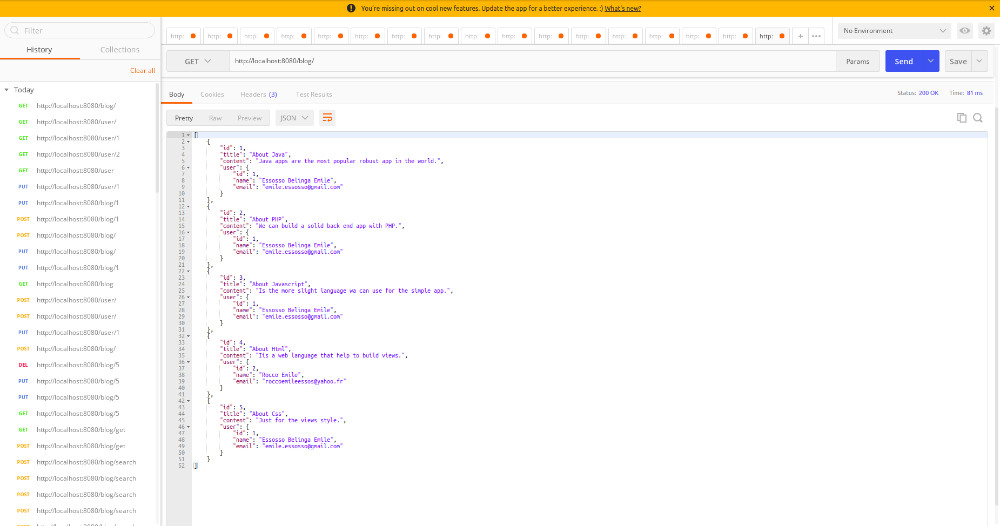
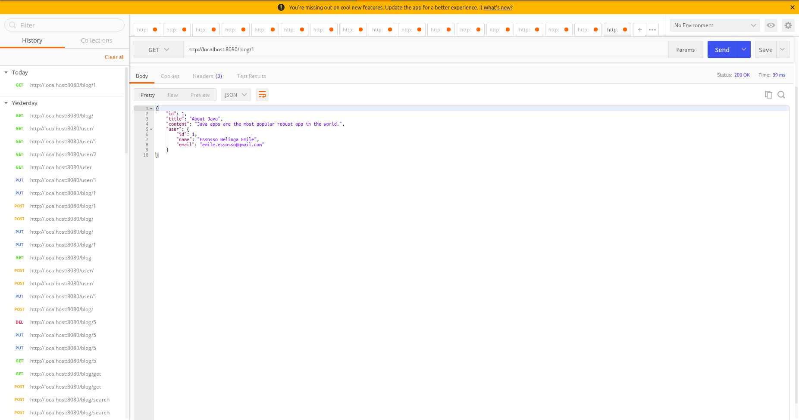
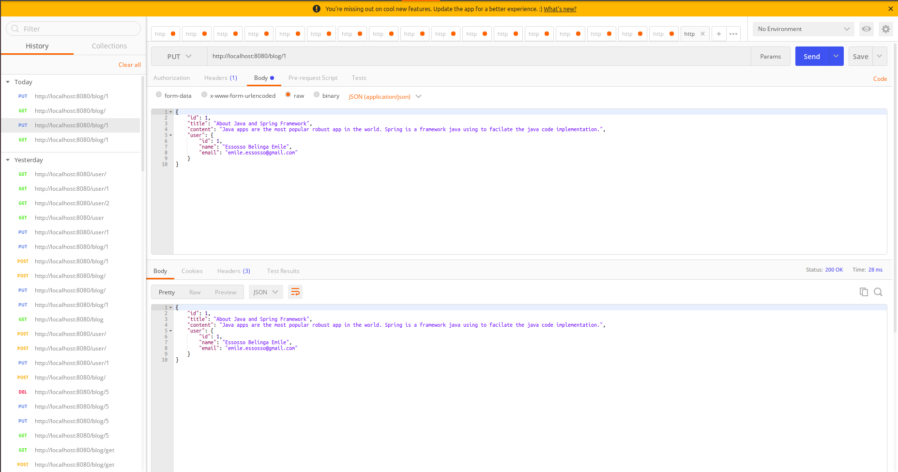
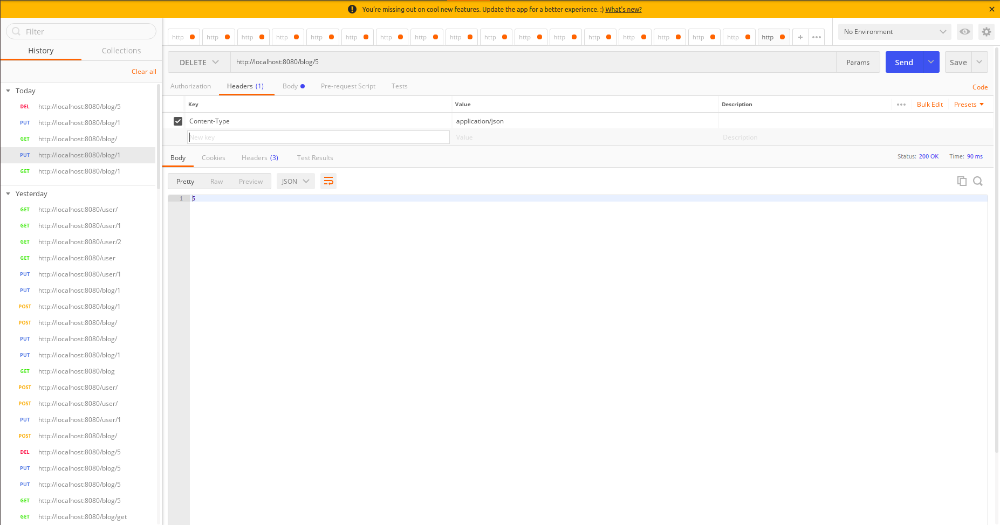
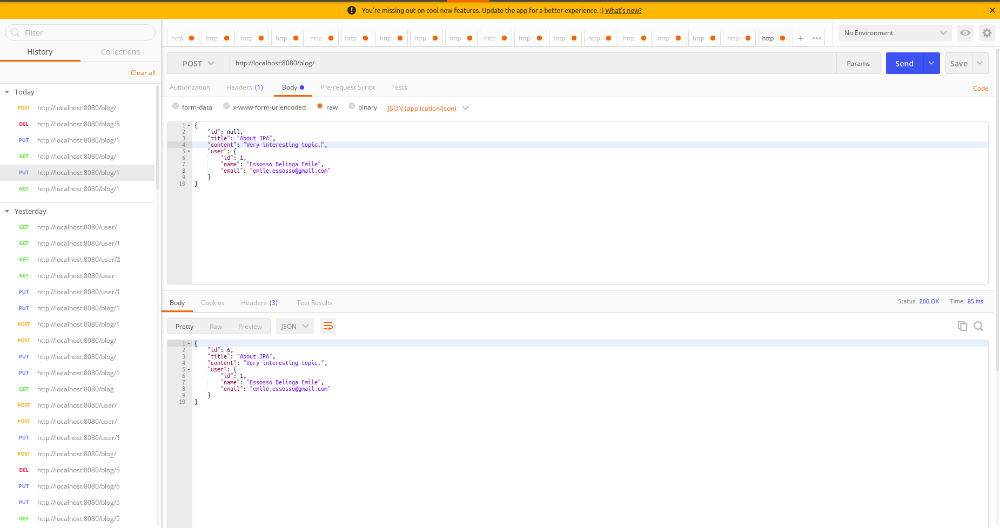
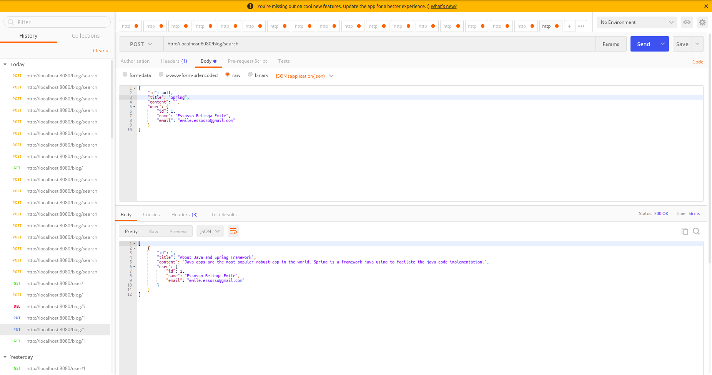
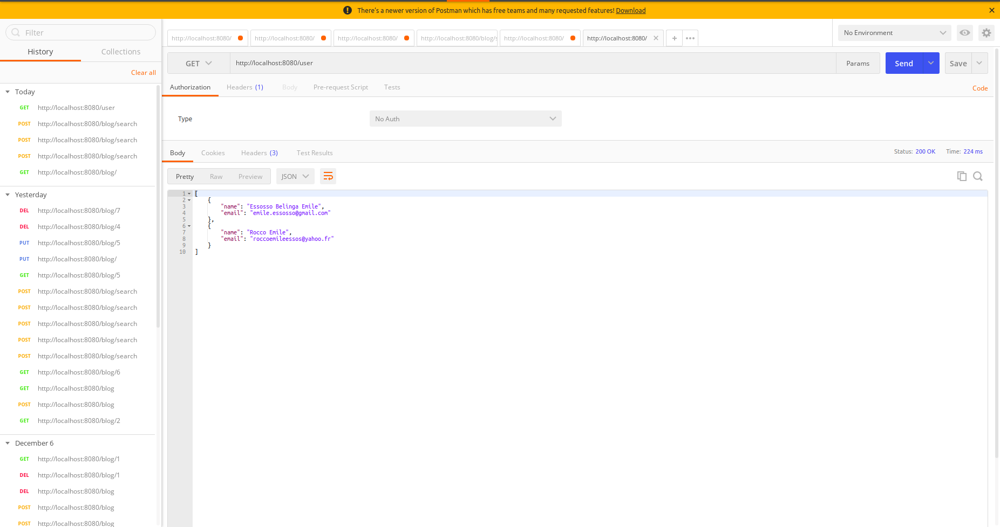
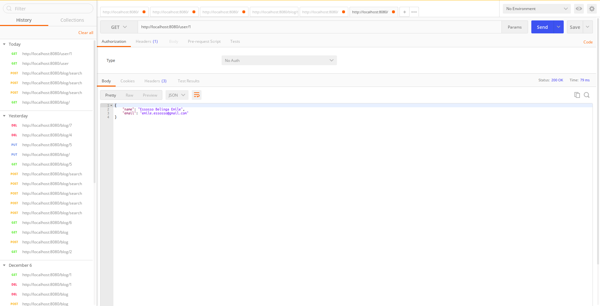

# ManageBlogs

### Overview
The ManageBlogs project is a Spring Boot Rest API with Mysql database and JPA. This is the Backend for a Blog website. This Backend manage users and blogs. The User can create, read, update, delete blogs. There is two ways to read a blog: The user can read a blog and list all the existing blogs. Also, for update the blog, the user must add the title (case sensitive), the app will research blog and update the blog corresponding at this id. 
Note that ManageBlogs is a robust Java app with more rest services that will handle by the front end part (Angula JS). This project is scalable and very easy to re-use codes.

### Tools
- Intellij IDEA.
- Mysql.
- Postman.

### Env
Linux server.

### Installation
Install Java and Jdk in the server. Also, install Intellij IDEA for web programmers.
Clone the project in the project repository, unzip and import in Intellij IDE.

Note that there are three ways to build a Spring Boot project, for this project I used the last one.
- Using a command lines;
- Using Spring Initializer interface inside Intellij IDEA;
- Using Maven in Intellij and integrated the Spring boot dependency (create a Maven project and add Spring Boot dependency in the `pom.xml` file.

### Some Postman tests

